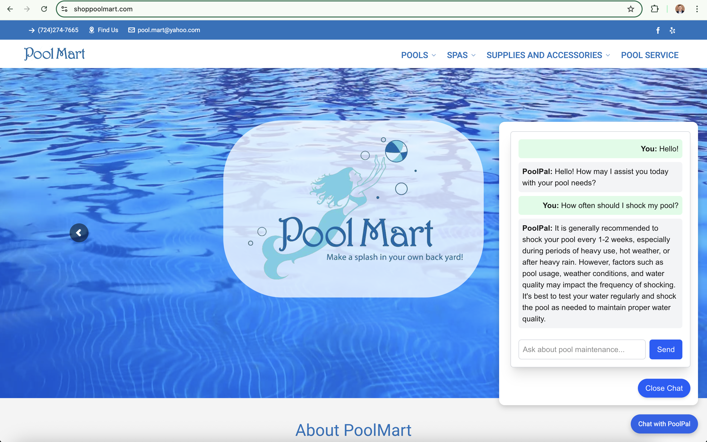

# 🏊‍♂️ PoolPal AI – Smart Chatbot for PoolMart

**PoolPal AI** is a lightweight, AI-powered chatbot built for small businesses in the pool and spa industry. Designed to integrate seamlessly into existing websites, it provides instant, friendly responses to customer questions using the OpenAI API.

---

## 🖼️ Live Demo

Here’s PoolPal running live on a customer site:



---

## ⚙️ Features

- 💬 Embedded chatbot UI (React)
- ⚡ Powered by OpenAI API
- 🔒 Hosted on [Vercel](https://vercel.com) with Cloudflare protection
- 🌐 Integrates into static or WordPress sites
- 🧠 Custom prompts + domain-specific training (optional)
- 🎯 Fully responsive and mobile-optimized

---

## 🚀 Tech Stack

- **Frontend**: React + Tailwind CSS
- **Hosting**: Vercel
- **AI Integration**: OpenAI API (with optional LangChain / RAG support)
- **Security & Performance**: Cloudflare CDN + WAF

---

## 🛠️ Getting Started

### 1. Clone the Repo

```bash
git clone https://github.com/your-username/pool-pal-ai.git
cd pool-pal-ai
